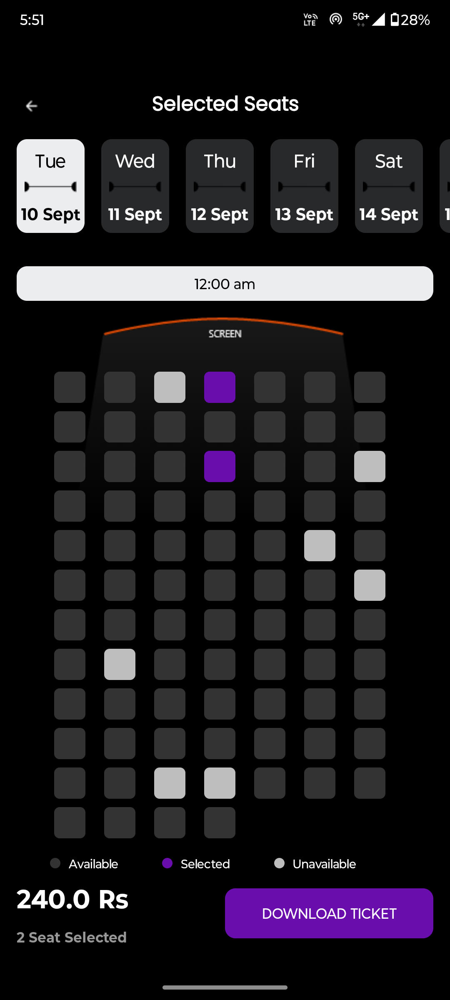
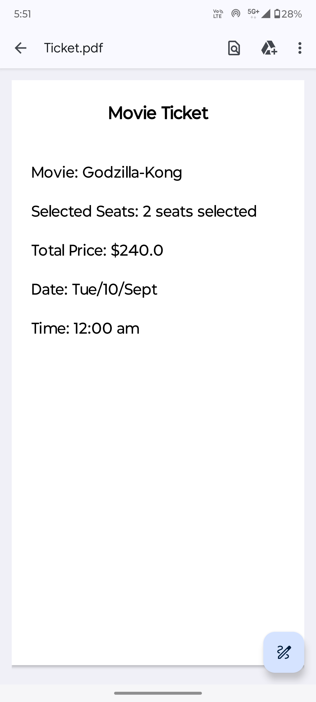
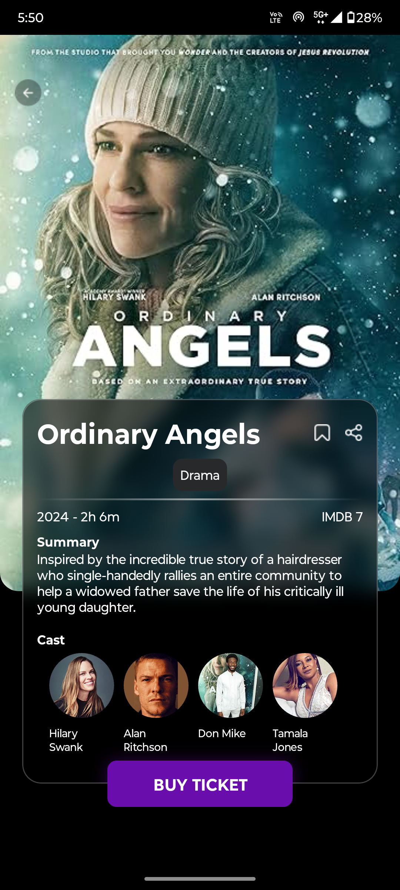
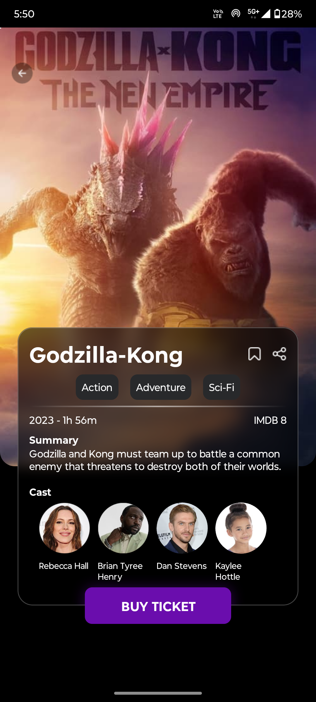
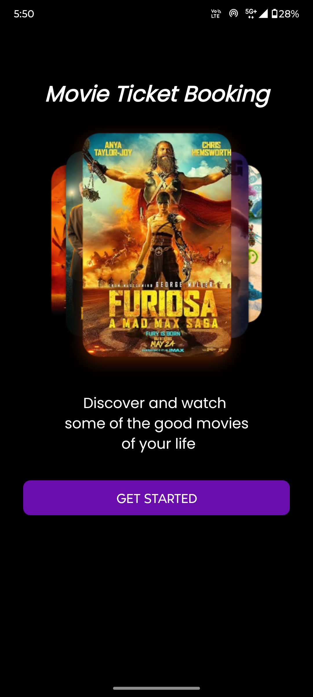

# 🎟️ Cinema Ticket Booking App

This project is an Android application designed and developed using Kotlin. The app allows users to book movie tickets by selecting their preferred seats in a cinema hall and generates a downloadable PDF ticket with all the details.

## ✨ Features

- 🖼️ **Clean UI:** The app provides a user-friendly interface for easy navigation and usability.
- 🚀 **Smooth Navigation:** Seamless transitions and navigation between screens for a great user experience.
- 🎬 **Seat Selection:** Users can choose seats from any row or column in the cinema hall.
- 📝 **Ticket PDF Generation:** After booking a ticket, the app generates a downloadable PDF containing all ticket details, including the movie, seat, and time.

## 📸 Screenshots

Here are some screenshots of the app in action:

<p align="center">
  
  
  
</p>

<p align="center">
  
  
  
</p>


## ⚙️ Installation

To run this project, follow these steps:

1. Clone the repository:
    ```bash
    git clone https://github.com/your-username/cinema-ticket-booking-app.git
    ```

2. Open the project in Android Studio.

3. Build the project and run it on an emulator or physical device.

## 🛠️ Technologies Used

- **Kotlin**: Primary language for Android development.
- **PDF Generation**: The app generates a PDF for the movie ticket with detailed information.
- **Android Jetpack Components**: Used for UI and navigation architecture.

## 🚦 How to Use

1. Open the app and browse the available movies.
2. Select a movie, choose your preferred time and cinema hall.
3. Select the seats by row and column.
4. Confirm your booking, and the app will generate a PDF ticket.
5. Download or view the PDF containing all the booking details.

## 📋 Requirements

- **Android Studio**: Version 4.1 or higher.
- **Android SDK**: Minimum SDK version 24 (Android 7.0).
- **Target SDK**: SDK 34.

## 🤝 Contributing

If you want to contribute to this project:

1. Fork the repository.
2. Create a new branch for your feature or bug fix.
3. Make your changes and commit them.
4. Push to your branch and create a pull request.
